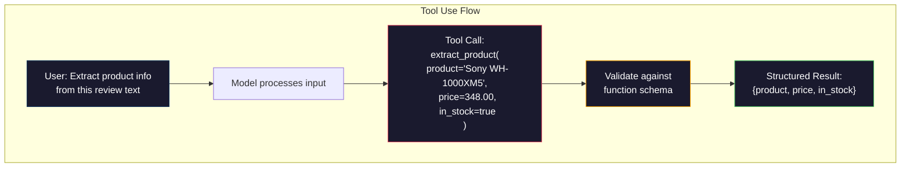

Structured output

4levely strukturovaného outputu

prompt based - (odpoved v platnom json , ziadne vynucovanie , v 90% pripadoch je model spolahlivy, mozne zlyhania v : skrateny vystup , nesprvna struktura

JSON mode - Api zarucuje , ze output je validny JSON, (pre OpenAI je schema response_format: { type: "json_object" }), output bude bez chyb , ale schema json sa nemusi zhodovat so schemou pozadovanou - extra kluce , zle typy , chybajuce polia  

schema mode - api zoberie json schemu a zaruci ze vystup bude zhodny s touto schemou.OpenAI's `response_format: { type: "json_schema",      json_schema: {...} }`,  Anthropic's tool use with `input_schema`,`response_schema` + `response_mime_type: "application/json"
vystup ma presne tie kluce ,typy ktore specifikujem

Constrained decoding - na kazdej pozicii tokenu pocas generovani dekoder maskuje(vynuluje) vsetky tokeny, ktore by viedli k nepatnemu vystupu. Pravdepodobnost ak schema vyzaduje cislo a model sa snazi vygenerovat pismeno je nulova.Model moze vytvorit iba token, ktory vedie k validnemu vystupu . 

Priklad schemy :
```json
{
  "type": "object",
  "properties": {
    "product": { "type": "string" },
    "price": { "type": "number", "minimum": 0 },
    "in_stock": { "type": "boolean" },
    "categories": {
      "type": "array",
      "items": { "type": "string" }
    }
  },
  "required": ["product", "price", "in_stock"]
}
```

schema hovoro: vystup muis byt objekt  so string `product`, non-negative number `price`, boolean `in_stock` a volitelnym polom stringov `categories`.
akykolvek vystup , ktory nezapada do schemy bude odmietnuty
Schema osetruje hard cases: vnorene objekty , polia s typovanymi polozkami , porovnavane vzorov( regex na stirng) atd.

V pythone sa pre tvorbu schem pouziva kniznica pydantic

### The Pydantic Pattern
```python
class Product(BaseModel):
    product: str
    price: float
    in_stock: bool
    categories: list[str] = []

```

### Function Calling / Tool Use

Namiesto toho , aby sme model priamo ziadali model pre produkciu  JSON, definujeme  nastroje, funkcie, s typovymi parametrami. Model vygeneruje volanie funkcie so strukturovanymi argumentami. OpenAI to nazyva "function calling", anthropic "tool using". Výsledok je rovnaky , strukturovane data.



Tool use sa uprednostnuje, ked model potebuje vybrat, ktoru funckiu volat , nie len vyplnit parametre. Ak mame 10 roznych schem extrakcie a model musi na zaklade vstupu vybrat spravnu, tool use poskytne výber schemy aj strukturovany vystup

### Common Failure Modes

**Hallucinated values**: vystup sa zhoduje so schemou ale obsahuje vymyslene data. Text obsahuje cenu $348 ale vrati `{"price": 299.99}`
**Enum confusion**: pole obmedzime na `["in_stock", "out_of_stock", "preorder"]` , model vrati `"available"` sematicky spravne, ale nie v povolenom formate. dobre constrained decoding (riadene, strukturované generovanie) tomuto predchadza, prompt-based nie
**Nested object depth**: hlboko vnorene schemy (4+ urovne) sposobuju viac chyb. Kazda uroven vnorenia je dalsim miesotm , kde mozdel moze stratit prehlad o strukture
**Array length**: model moze produkovat prilis vela alebo prilis malo poloziek v poli. Schemy podporuju `minItems` a `maxItems`, alenie vsetci poskytovatelai ich presdzuju na urovni dekodovania.
**Optional field omission**:" mdoel vynecha polia, ktore su technicky volitelne ale sematicyk dolezite pre nas use case. Nastavte ich ako povinne aj ked niekedy udaje chybaju, vynutte aby model explicitne generoval hodnotu null