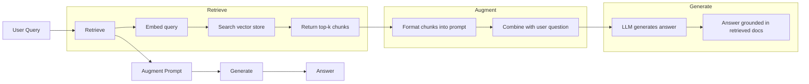
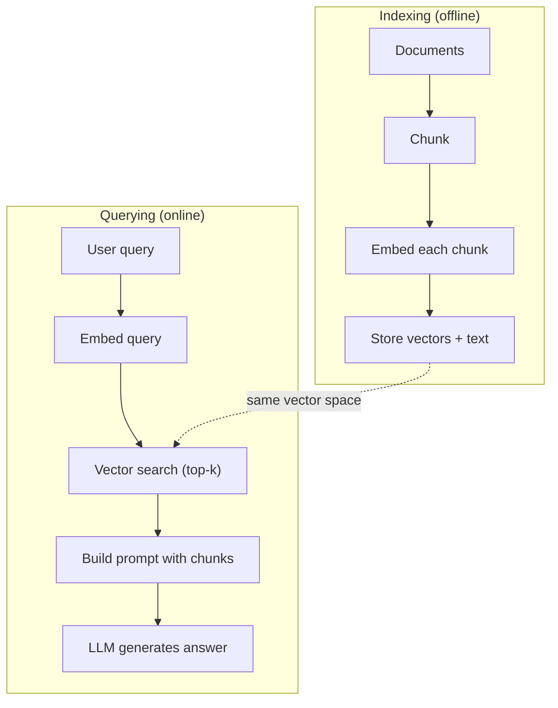

Tvoj LLM pozná vsetko lne po datum svojho natrenovania. Nepozna dokumenty t vojej firmy , tvoj zdrojovy kod ani poznamky z porady z minuleho tyzdna.

RAG (Retrieval-AUgemented Generation) tento problem riesi tak , ze najskor vyhlada relevantne dokumenty a nasledne ich vlozi do promptu ako kontext..

Je to najca stejsie nasadzovany vzor v produkcnych AI rieseniach.

## Learning Objectives

- vytvor kompletny RAG pipeline: document loading , chunking , embedding, vector storage, retrieval, generation
- implementuj semantic search s pouzitim vectorovej databazy ( ChromaDB , FAISS or Pinecone) so spr avnym indexovanim
- vysvetli , prco je RAG preferovane pred fine-tunning  pre knowledge-grounded aplikacei , (cost, freshness, attribution)
- Vyhodnocuj kvalitu RAG systému pomocou:

    Retrieval metrík (kvalita vyhľadávania)
    Precision (presnosť) – aký podiel nájdených dokumentov je skutočne relevantný.
    Recall (úplnosť/zachytenie) – aký podiel všetkých relevantných dokumentov sa podarilo nájsť.
    Generation metrík (kvalita generovania odpovede)
    Faithfulness (vernosť zdrojom) – do akej miery odpoveď zodpovedá poskytnutým dokumentom a nevymýšľa si informácie (minimalizácia halucinácií).
    Relevance (relevantnosť) – do akej miery odpoveď skutočne odpovedá na používateľovu otázku.

## The Problem

Vytvoríš chatbot pre svoju firmu a zákazník sa opýta: „Aká je politika vrátenia peňazí pre enterprise plány?“ LLM odpovie všeobecnou odpoveďou o bežných SaaS podmienkach refundácie, no skutočná politika firmy, ukrytá v 200-stranovej internej wiki, stanovuje 60-dňovú lehotu s pomerným vrátením peňazí. Keďže model tento dokument nikdy nevidel, nemôže poznať jeho obsah. Nemôže vedieť to, na čom nebol natrénovaný. Preto sa v podnikových aplikáciách používa RAG, ktorý najprv vyhľadá relevantný dokument a poskytne ho modelu ako kontext, aby mohol odpovedať správne a podľa firemných pravidiel.

Fine tunning je jednym zrieseni. Zober llm , vytrenuj ho na internych dokumntoch , sprav deploy updatnutemu modelu. Problemom tohot riesenia je , ze stoji tisice dolarov. Model sa stane neaktualnym v momente , kedy sa dokument zmeni. Nevies z ktoreho zdroja model cerpa. Opatovane fine tunnig pr novych produktoch.

RAG je dalsim riesenim. Ponechaj model nedotknuty. Kedy pride na otazku , prehladaj ulozisko dokumentov pre relevatne pasaze, vloz ich do promptu pred otazkou , nechaj model odpovedat za zaklade tychto pasazi ako context pre model.Ulozisko dokumnetov mozes byt updatnute v priebehu minut, vies ktore dokumenty pouzil, model sa  sam o sebe nemeni. Toto je dovod, preco je RAG dominantny pattern v produkcii: lacnejsi , pracuje s aktualnymi datami, umožňuje jednoduchšie overenie zdrojov, funguje na akomkolvek LLM.

### The RAG Pattern

The entire pattern fits in four steps:



Dopyt => Vyhladanie => Rozsirenie promtu => Generovanie odpovede. Kazdy RAG system naselduje tento zakladny vzor.Rozdiely medzi produkcnymi RAG rieseniami spocivaju v detailoch jednotlivych krokov ako sa dokumenty rozdeluju na mensie casti(chunking) ako sa vytvaraju embeddingy, akym sposobom prebieha vyhladavanie relevatnyc h informacii a ako sa naseldne zosta vuje prompt , ktory model pouzije na vygenerovanie odpovede.

### Why RAG Beats Fine-Tuning

Fine-tunning zmeni spravanie modelu pernamentne  , rag zmeni context modelu docasne.Pre vacsinou aplikacii , docasny context je to  , co chces.
Ppripad kde fine tunning vyhrava je , ked chceme pre model nastvit specificky  styl,  ton , reasoning patern ktory nemoze byt dosiahnuty cez prompt samotny .

### Embedding Models

| Model | Dimensions | Provider | Notes |
|-------|-----------|----------|-------|
| text-embedding-3-small | 1536 (Matryoshka) | OpenAI | Best price/performance for most use cases |
| text-embedding-3-large | 3072 (Matryoshka) | OpenAI | Higher accuracy, truncatable to 256/512/1024 |
| Gemini Embedding 2 | 3072 (Matryoshka) | Google | Top MTEB retrieval; 8K context |
| voyage-4 | 1024/2048 (Matryoshka) | Voyage AI | Domain variants (code, finance, law) |
| Cohere embed-v4 | 1024 (Matryoshka) | Cohere | Strong multilingual, 128K context |
| BGE-M3 | 1024 (dense + sparse + ColBERT) | BAAI (open-weight) | Three views from one model |
| Qwen3-Embedding | 4096 (Matryoshka) | Alibaba (open-weight) | Top open-weight retrieval score |
| all-MiniLM-L6-v2 | 384 | Open-weight (Sentence Transformers) | Prototyping baseline |

### Vector Similarity
**Cosine similarity**: cosinus uhla medzi dvoma vektormi, ignoruje magnitudu , zaujima ho ibna smer , default pre rag. od -1(opposite) do 1(identicke)
    ```
    cosine_sim(a, b) = dot(a, b) / (||a|| * ||b||)
    ```
**Dot product**: Surový skalárny súčin (inner product). Väčšie vektory získavajú vyššie skóre. Tento prístup je užitočný v prípadoch, keď veľkosť (magnitúda) vektora nesie dodatočnú informáciu – napríklad keď dlhšie dokumenty môžu obsahovať viac relevantného obsahu a preto by mali mať vyššiu váhu pri vyhľadávaní.
    ```
    dot(a, b) = sum(a_i * b_i)
    ```

**L2 (Euclidean) distance** : vzdialenosť predstavuje priamu vzdialenosť medzi dvoma bodmi vo vektorovom priestore. Čím je vzdialenosť menšia, tým sú si vektory podobnejšie. Táto metrika je citlivá na rozdiely vo veľkosti (magnitúde) vektorov, takže dva vektory s rovnakým smerom, ale odlišnou dĺžkou môžu byť považované za menej podobné.

Cosine similarity si dobre poradí s dokumentmi rôznej dĺžky, pretože normalizuje veľkosť (magnitúdu) vektorov a porovnáva predovšetkým ich smer. Vďaka tomu nie sú dlhšie dokumenty automaticky zvýhodnené len preto, že obsahujú viac textu. Keď niekto hovorí o „vektorovom vyhľadávaní“, vo väčšine prípadov má na mysli práve vyhľadávanie založené na cosine similarity.

## Chunking strategies
Pri RAG sa dokumenty pred vytvorením embeddingov rozdeľujú na menšie časti (chunky), pretože veľké dokumenty často obsahujú viacero tém a jeden embedding by nedokázal dostatočne presne reprezentovať celý obsah.

Fixed-size chunking – dokument sa rozdelí na chunky s pevným počtom tokenov, napríklad 512 tokenov s prekrytím (overlapom) 50 tokenov. Ide o jednoduchý a predvídateľný prístup, ktorý zabraňuje strate informácií na hraniciach chunkov.

Semantic chunking – dokument sa rozdeľuje podľa prirodzených hraníc textu, ako sú odseky, sekcie alebo nadpisy. Každý chunk tak predstavuje jednu ucelenú myšlienku, čo zvyčajne vedie k presnejšiemu vyhľadávaniu.

Recursive chunking – dokument sa najprv pokúša rozdeliť podľa najväčších logických celkov (sekcie, kapitoly). Ak sú stále príliš veľké, rozdelia sa na odseky a následne podľa viet. Tento prístup používa napríklad LangChain a v praxi patrí medzi najefektívnejšie.

Veľkosť chunkov má významný vplyv na kvalitu RAG systému. Príliš malé chunky (64–128 tokenov) často strácajú kontext, zatiaľ čo príliš veľké chunky (2048+ tokenov) obsahujú viacero tém a znižujú presnosť vyhľadávania. Za optimálnu veľkosť sa najčastejšie považuje 256–512 tokenov s približne 50-tokenovým overlapom, čo odporúčajú aj produkčné RAG smernice.

### Vector Databases

Once you have embeddings, you need somewhere to store and search them. Options:

| Database | Type | Best for |
|----------|------|----------|
| FAISS | Library (in-process) | Prototyping, small to medium datasets |
| Chroma | Lightweight DB | Local development, small deployments |
| Pinecone | Managed service | Production without ops overhead |
| Weaviate | Open source DB | Self-hosted production |
| pgvector | Postgres extension | Already using Postgres |
| Qdrant | Open source DB | High-performance self-hosted |

For this lesson, we build a simple in-memory vector store. It stores vectors in a list and does brute-force cosine similarity search. This is equivalent to FAISS with a flat index. It scales to maybe 100,000 vectors before getting slow. Production systems use approximate nearest neighbor (ANN) algorithms like HNSW to search millions of vectors in milliseconds.

### Full Pipeline



Indexačná fáza sa vykonáva iba raz pre každý dokument (alebo pri jeho aktualizácii). Počas nej sa dokument spracuje, rozdelí na chunky, vytvoria sa embeddingy a tie sa uložia do vektorovej databázy.

Dopytovacia fáza (querying) sa vykonáva pri každej používateľskej otázke. Systém vytvorí embedding otázky, vyhľadá najrelevantnejšie chunky a odošle ich modelu ako kontext pre vygenerovanie odpovede.

V produkčnom prostredí môže indexácia spracovávať milióny dokumentov počas niekoľkých hodín, zatiaľ čo vyhľadávanie a generovanie odpovede musí používateľovi poskytnúť výsledok zvyčajne za menej ako jednu sekundu.

### Real Numbers

Most production RAG systems use these parameters:

- **k = 5 to 10** retrieved chunks per query
- **Chunk size = 256 to 512 tokens** with 50-token overlap
- **Context budget**: 2,500-5,000 tokens of retrieved content per query
- **Total prompt**: ~8,000-16,000 tokens (system prompt + retrieved chunks + conversation history + user query)
- **Embedding dimension**: 384-3072 depending on model
- **Indexing throughput**: 100-1,000 documents per second with API embeddings
- **Query latency**: 50-200ms for retrieval, 500-3000ms for generation