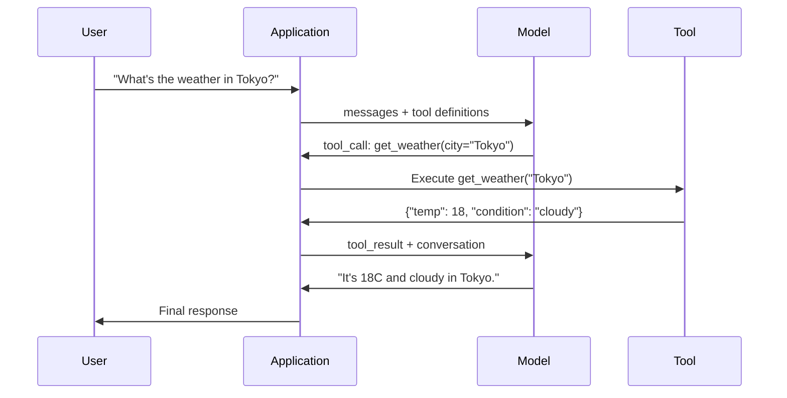

### The Function Calling Loop

Every tool-use interaction follows the same 5-step loop.



Step 1: the user sends a message. Step 2: the model receives the message along with tool definitions (JSON Schema describing available functions). Step 3: instead of responding with text, the model outputs a tool call -- a structured JSON object with the function name and arguments. Step 4: your code executes the function and captures the result. Step 5: the result goes back to the model, which now has real data to produce its final answer.


The model never executes anything. It only decides what to call and with what arguments. Your code is the executor.

### Tool Choice: Auto, Required, Specific

**Auto** model rozhoduje ci zavola tool alebo hned odpovie
**Required** model musi zavolat najmenej jeden tool, pouzit ked presne vtedy ,ked viem , ze user intent vyzaduje tool
**Specific function** nuti model volat konkretnu funkciu `tool_choice={"type":"function", "function": {"name": "get_weather"}}`

### Parallel Function Calling

GPT-4o a Claude moze volat viacero funkcii v jednom volani.  "What's the weather in Tokyo and New York?",
```json
[
  {"name": "get_weather", "arguments": {"city": "Tokyo"}},
  {"name": "get_weather", "arguments": {"city": "New York"}}
]
```

### Structured Outputs vs Function Calling

**Structured outputs**: nuti model produkovat data v specifickom tvare, output je finalny produkt.
**Function calling**: Model deklaruje zámer vykonať akciu. Výstupom je medzikrok. Príklad: `get_weather(city="Tokyo")` -- model požaduje akciu, nie produkuje konečnú odpoveď.

Strukturovane vystupy pre data extrakciu , function calling ,ked je potrebna ionterakcia modelu a externych systemov.

### Security: The Non-Negotiable Rules

Fucntion calling je najnebezpecnejsia funkcionalita ,ktoru mozes modelu dat . Model sa rozhoduje co vykona , ak chces aby vytvaral databazove query, bude robit query , ak shell command , model ich bude pisat.

**Rule 1: Never pass model-generated SQL directly to a database.**. Model môže vytvoriť nebezpečné dotazy (napr. DROP TABLE), SQL injection alebo vrátiť všetky dáta. Vždy používaj parametrizáciu, validáciu a povolený zoznam operácií.

**Rule 2: Allowlist functions.** 
Model môže volať iba funkcie, ktoré mu explicitne sprístupníš. Nikdy nevytváraj generický nástroj typu „spusť ľubovoľnú funkciu podľa názvu“. Ak máš 50 interných funkcií, sprístupni len tých 5, ktoré používateľ naozaj potrebuje.

**Rule 3: Validate arguments.** Model môže odovzdať názov mesta ako "; DROP TABLE users; --". Pred vykonaním vždy validuj každý argument podľa očakávaného typu, rozsahu a formátu.

**Rule 4: Sanitize tool results.** Ak tool vracia citlive data (API kluce , PII , interne chyby), vyfiltruj ich predtym ako ch posles spat modelu.Model môže výsledky nástrojov doslovne zahrnúť do svojej odpovede. Preto nikdy neposielaj nástrojom citlivé údaje, ktoré by sa nemali zobraziť používateľovi.

**Rule 5: Rate limit tool calls.** Model v cykle moze volat nastroje stovky krat , nastavit  maximum 10-20 volani za konverzaciu je rozumne. Prerus nekonecny loop

### Error Handling
Model potrebuje vediet , kedy tool zlyhal a preco.
Vracaj chyby ako strukturovany tool output, nie ako exceptions:

```json
{
  "error": true,
  "message": "City 'Toky' not found. Did you mean 'Tokyo'?",
  "code": "CITY_NOT_FOUND"
}
```

### MCP: Model Context Protocol

MCP (Model Context Protocol) je otvorený štandard od Anthropicu pre interoperabilitu nástrojov. Namiesto toho, aby si každá aplikácia definovala vlastné nástroje, MCP poskytuje univerzálny protokol: nástroje sú poskytované MCP servermi a využívané MCP klientmi (napr. Claude Code, Cursor alebo vlastné aplikácie).

Jeden MCP server môže sprístupniť svoje nástroje ľubovoľnému kompatibilnému klientovi. Napríklad Postgres MCP server poskytne databázový prístup každému MCP agentovi, GitHub MCP server zase prístup k repozitárom. Nástroje sa definujú raz a používajú všade.

MCP je pre volanie funkcií to, čo je HTTP pre sieťovú komunikáciu. Štandardizuje transportnú vrstvu, vďaka čomu sa nástroje stávajú prenositeľnými medzi rôznymi AI aplikáciami a agentmi.
